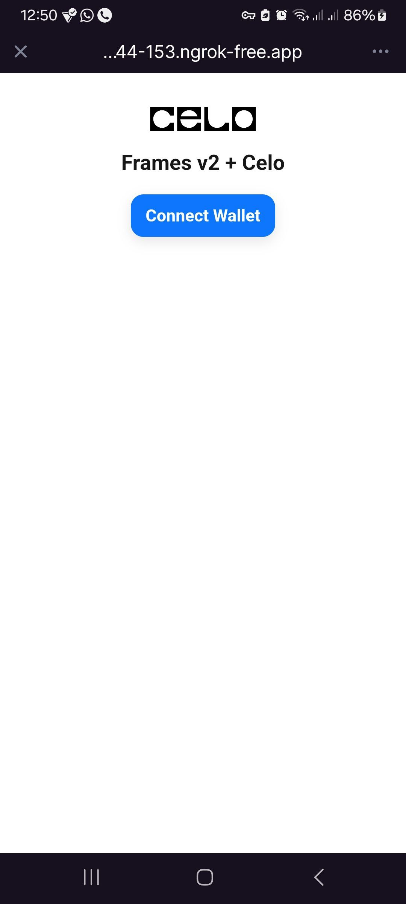
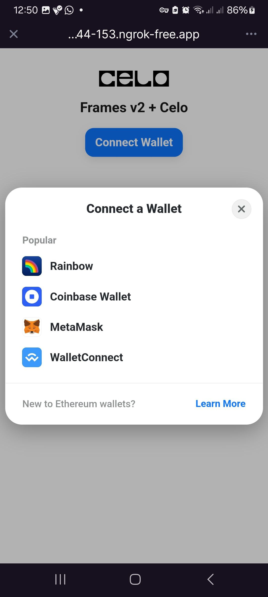
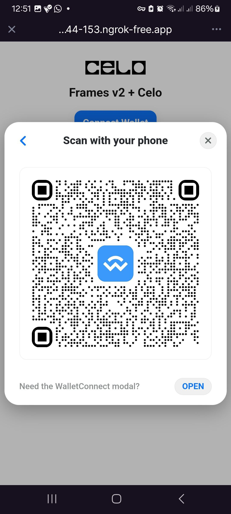
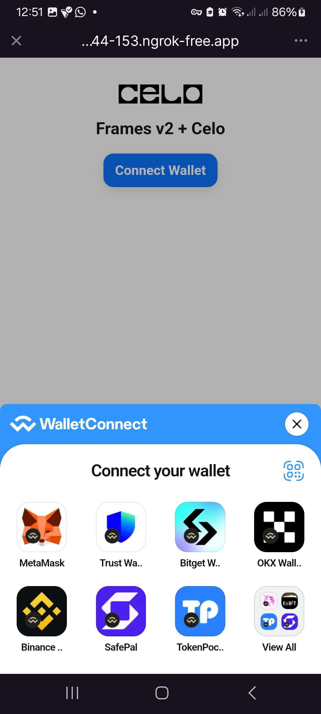
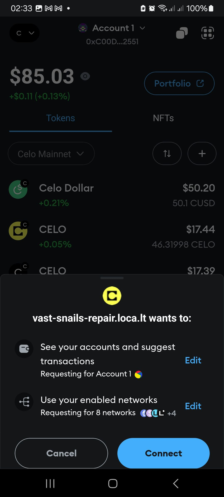
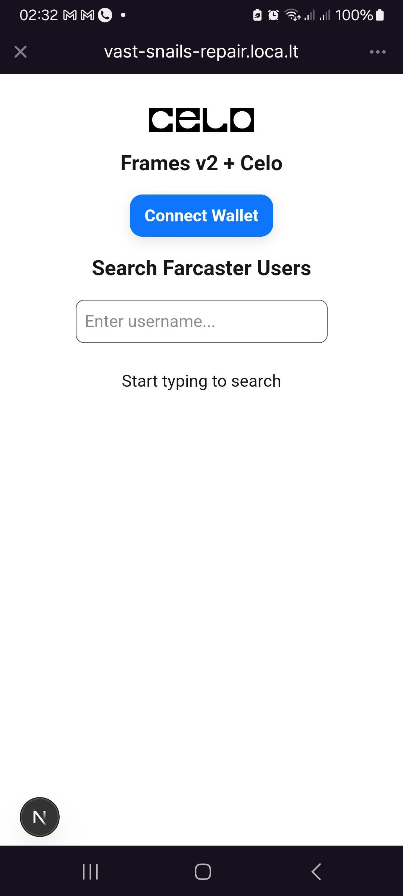
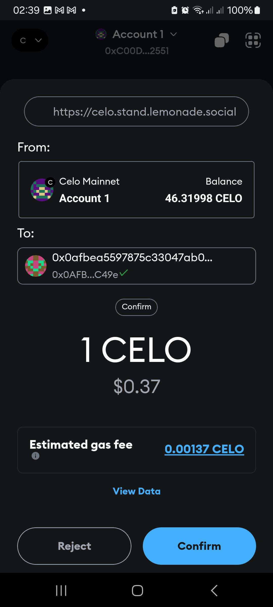

# Celo x Farcaster Frame for a Simple Paybot

This demo project is based on the [Farcaster V2 Frame](https://docs.farcaster.xyz/developers/frames/v2/getting-started). The project demonstrates a simple Farcaster paybot frame that allows users to search for people on Farcaster and tip them with Celo tokens.
You can test the project with the live deployed version : [https://farcaster-frame-celo-template.vercel.app/](https://farcaster-frame-celo-template.vercel.app/).

## Getting Started

### Clone the Repository

```bash
git clone https://github.com/celo-org/celo-farcaster-frames/
cd celo-farcaster-frames
```

### Open the Project

```bash
code .
```

### Navigate to the Template Directory

```bash
cd celo-paybot-template
```

### Install Dependencies

```bash
npm install
```

### Add Environment Variables

Create a `.env` file and add the following:

```bash
NEXT_PUBLIC_URL=http://localhost:3000
NEXTAUTH_URL=http://localhost:3000
NEXTAUTH_SECRET=your_generated_secret_here
NEXT_PUBLIC_WALLETCONNECT_PROJECT_ID=YOUR_WALLET_CONNECT_PROJECT_ID
NEXT_PUBLIC_PINATA_JWT=YOUR_PINATA_JWT
```

### Run the Application

```bash
npm run dev
```

### Expose Local Server Using ngrok

To test the application in the developer playground, use `ngrok` to expose your local development server:

```bash
ngrok http http://localhost:3000
```

### Access the Frame Playground

1. Open the **Frame Playground** on Warpcast mobile.
2. Go to **Settings** → **Developer** → **Frames**.
3. Ensure **Developer Mode** is turned on.
4. Enter your ngrok URL.


### Add Splash Image URL

To enhance the loading experience, add a splash image and background color:


Once configured, you will see a nice background color and splash image while the app is loading:


### Connect Your Celo Wallet

Once the app is loaded, connect your Celo wallet to proceed.

<div style="display: flex; gap: 10px;">
  
  
  
  
  
</div>

### Search for a Farcaster User

The Farcaster search form will pop up. Enter a username to search for a person.

<div style="display: flex; gap: 10px;">
    
    
</div>

### Send Tokens

1. Select the person, which will automatically redirect you to the send token form.
2. Choose the preferred network.
3. Enter the amount you want to send.

<div style="display: flex; gap: 10px;">
    
    
</div>

4. Click the **Send** button, which will route you to your wallet for transaction approval.

## How It Works

The project utilizes the following technologies:

- **Farcaster SDK**
- **Wagmi**
- **viem@2.x**
- **@tanstack/react-query**
- **RainbowKit**

### Providers Setup

The `Providers` component includes all necessary providers, such as Wagmi and RainbowKit:

```tsx
<WagmiProvider config={rainbowConfig}>
  <QueryClientProvider client={queryClient}>
    <RainbowKitProvider>{children}</RainbowKitProvider>
  </QueryClientProvider>
</WagmiProvider>
```

Since the SDK relies on the browser window, we define this as a client component and use dynamic imports:

```tsx
"use client";

import dynamic from "next/dynamic";

const WagmiProvider = dynamic(
  () => import("@/components/providers/WagmiProvider"),
  {
    ssr: false,
  }
);

export function Providers({ children }: { children: React.ReactNode }) {
  return <WagmiProvider>{children}</WagmiProvider>;
}
```

### Session Management

The `SessionProvider` uses **NextAuth.js** and `@farcaster/auth-client` to ensure authentication details (session) are available throughout the app.

### Fetching Farcaster Users

We use the **Pinata API** to fetch Farcaster users, as the current Farcaster SDK only allows fetching users based on their FID. The API helps search users by their username:

```tsx
const res = await fetch(
  `https://api.pinata.cloud/v3/farcaster/users?username=${query}`,
  {
    headers: {
      Authorization: `Bearer ${process.env.NEXT_PUBLIC_PINATA_JWT}`,
    },
  }
);
```

### Sending Celo Tokens

Once the user selects the amount, the transaction is handled using **wagmi**:

```tsx
await sendTransaction({
  to: selectedUser.verifications[0], // Use the user's verification address
  value: value,
  chainId: 42220,
});
```

## Learn More

To learn more about Farcaster and Celo, explore the following resources:

- [Farcaster V2 Frame](https://docs.farcaster.xyz/developers/frames/v2/getting-started) - Learn about Farcaster frames and SDK.
- [Learn Celo](https://docs.celo.org/) - Explore Celo's blockchain ecosystem.
